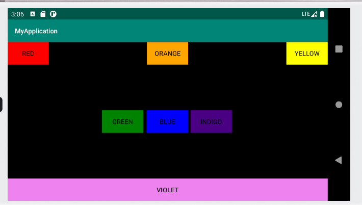

# 实验二：Android布局

1.线性布局

代码在如下链接

[layout1.xml](https://github.com/zhengjianjian/Android/blob/master/app/src/main/res/layout/layout1.xml)

运行结果如下：

2.约束布局

代码在如下链接

[layout2.xml](https://github.com/zhengjianjian/Android/blob/master/app/src/main/res/layout/constraintlayout.xml)

运行结果如下：

3.表格布局

代码在如下链接

[layout3.xml](https://github.com/zhengjianjian/Android/blob/master/app/src/main/res/layout/layout3.xml)

运行结果如下：

