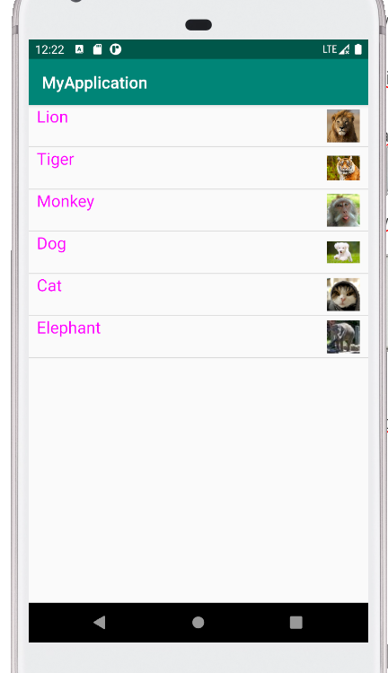
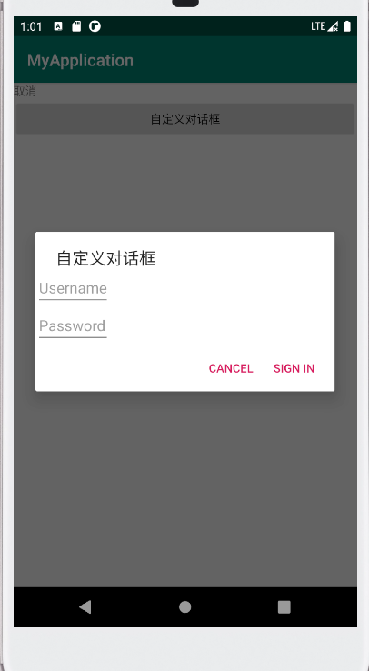
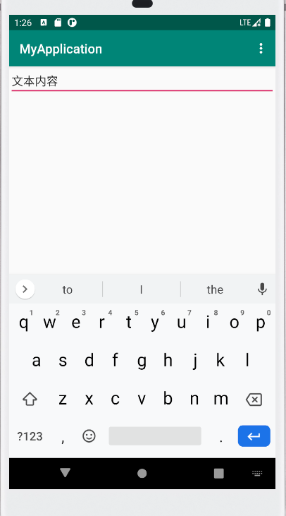
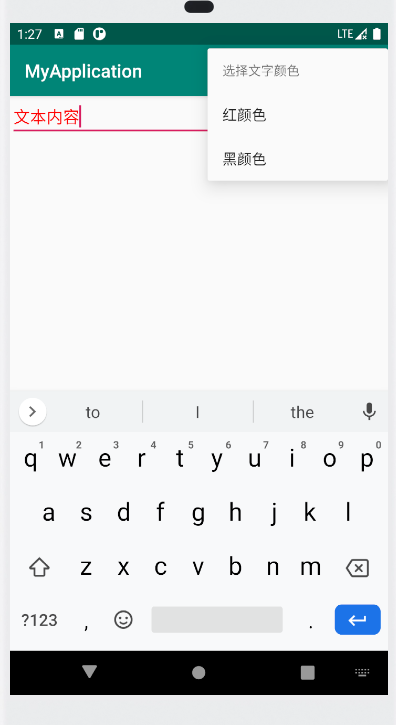
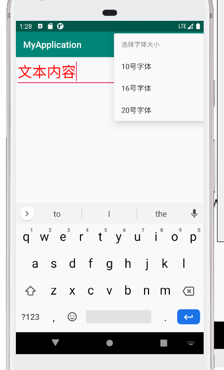
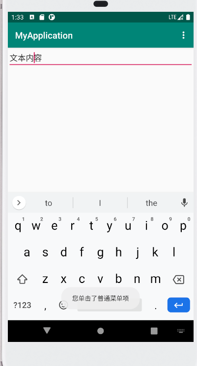

# 实验三 UI组件

## 1.android listView的用法

​     （1）编写布局文件activity_main.xml，如下：

```
<?xml version="1.0" encoding="utf-8"?><androidx.constraintlayout.widget.ConstraintLayout xmlns:android="http://schemas.android.com/apk/res/android"    android:orientation="horizontal"   
android:layout_width="match_parent"    
android:layout_height="match_parent">   
<!--定义一个listview -->    
<ListView       
android:id="@+id/mylist"        
android:layout_width="match_parent"       
android:layout_height="match_parent" /></androidx.constraintlayout.widget.ConstraintLayout>
```

（2）编写布局文件simple_item.xml，如下：

```
<?xml version="1.0" encoding="utf-8"?>
<LinearLayout xmlns:android="http://schemas.android.com/apk/res/android"          
android:orientation="horizontal"    
android:layout_width="match_parent"    
android:layout_height="match_parent">    
<TextView android:id="@+id/name"       
          android:layout_width="wrap_content"       
          android:layout_height="wrap_content"        
          android:layout_weight="1"       
          android:paddingLeft="10dp"        
          android:textColor="#f0f"        
          android:textSize="20sp"/>    
 <ImageView android:id="@+id/header"        
      android:layout_width="50dp"        
      android:layout_height="50dp"        
      android:layout_gravity="right"        
      android:paddingRight="10dp"/></LinearLayout>
```

（3）java代码如下：

package com.example.test3;
import androidx.appcompat.app.AppCompatActivity;
import android.os.Bundle;
import android.view.Gravity;
import android.view.View;
import android.widget.AdapterView;
import android.widget.ListView;
import android.widget.SimpleAdapter;
import android.widget.Toast;
import java.util.ArrayList;
import java.util.HashMap;
import java.util.List;
import java.util.Map;
public class MainActivity extends AppCompatActivity {
private String[] names = new String[]
{"Lion","Tiger","Monkey","Dog","Cat","Elephant"};
private int[] ImageIds = new int[]{R.drawable.lion,R.drawable.tiger,
R.drawable.monkey, R.drawable.dog,R.drawable.cat,R.drawable.elephant};
@Override
protected void onCreate(Bundle savedInstanceState) {
super.onCreate(savedInstanceState);
setContentView(R.layout.activity_main);
List<Map<String,Object>> listItems = new ArrayList<>();
for (int i=0;i<names.length;i++)
{
Map<String, Object> listItem = new HashMap<>();
listItem.put("name",names[i]);
listItem.put("header",ImageIds[i]);
listItems.add(listItem);
}
SimpleAdapter simpleAdapter = new SimpleAdapter(this,listItems,R.layout.simple_item,
new String[]{"name","header"},new int[]{R.id.name,R.id.header});
ListView list = findViewById(R.id.mylist);
list.setAdapter(simpleAdapter);
list.setOnItemClickListener(new AdapterView.OnItemClickListener()
{
@Override
public void onItemClick(AdapterView<?> parent, View view, int position, long id) {
System.out.println(names[position] + "被单击了");
//居中
Toast toastCenter = Toast.makeText(getApplicationContext(),names[position],Toast.LENGTH_LONG);
toastCenter.setGravity(Gravity.CENTER,0,0);
toastCenter.show();
}
public void onNothingSelected(AdapterView<?> parent)
{
}
});
}
}

运行结果如下：



## 2.创建自定义布局的AlertDialog

(1)布局代码如下：

```
<?xml version="1.0" encoding="utf-8"?>
<TableLayout xmlns:
android="http://schemas.android.com/apk/res/android"    
android:orientation="vertical"    
android:layout_width="match_parent"    
android:layout_height="match_parent">    
<TextView        android:id="@+id/show"        
                 android:layout_height="wrap_content"
                 android:layout_width="match_parent"/>    
<Button        android:id="@+id/button"        
               android:layout_height="wrap_content"        
               android:layout_width="match_parent"       
               android:onClick="customView"       
               android:text="自定义对话框" /></TableLayout>
```

```
<?xml version="1.0" encoding="utf-8"?>
<TableLayout xmlns:
android="http://schemas.android.com/apk/res/android"              android:orientation="vertical" 
android:layout_width="match_parent"    
android:layout_height="match_parent">    
<TableRow>        
<EditText            
android:layout_width="match_parent"            
android:layout_height="wrap_content"            
android:hint="Username"            
android:selectAllOnFocus="true" />    
</TableRow>    
<TableRow>        
<EditText            
android:layout_width="match_parent"            
android:layout_height="wrap_content"           
android:hint="Password"            
android:inputType="textPassword"/>    
</TableRow>
</TableLayout>
```

（2）java代码如下：

import androidx.appcompat.app.AppCompatActivity;
import android.os.Bundle;
import android.app.AlertDialog;
import android.view.View;
import android.widget.TableLayout;
import android.widget.TextView;
public class MainActivity extends AppCompatActivity {
private TextView show;
@Override
protected void onCreate(Bundle savedInstanceState) {
super.onCreate(savedInstanceState);
setContentView(R.layout.activity_main);
show = findViewById(R.id.show);
}
public void customView(View source)
{
TableLayout  logininfo ;
logininfo     = (TableLayout) getLayoutInflater().inflate(R.layout.login, null);
new AlertDialog.Builder(this)

.setTitle("自定义对话框")

.setView(logininfo)

.setPositiveButton("Sign in", (dialog, which) -> {show.setText("登陆");
})

.setNegativeButton("Cancel", (dialog, which) -> {show.setText("取消");
})
.create().show();
}
}

运行结果如下：



## 3.使用XML定义菜单

（1）布局代码如下：

```
<?xml version="1.0" encoding="utf-8"?>
<androidx.constraintlayout.widget.ConstraintLayout xmlns:android="http://schemas.android.com/apk/res/android"    xmlns:app="http://schemas.android.com/apk/res-auto"    xmlns:tools="http://schemas.android.com/tools"    
android:layout_width="match_parent"    
android:layout_height="match_parent"    
tools:context=".MainActivity">    
<EditText        android:id="@+id/aaa"        
                 android:layout_width="match_parent" 
                 android:layout_height="wrap_content"        
                 android:text="文本内容"        
                 tools:ignore="MissingConstraints" /></androidx.constraintlayout.widget.ConstraintLayout>
```

（2）java代码如下：

import androidx.appcompat.app.AppCompatActivity;
import android.os.Bundle;
import android.graphics.Color;
import android.view.Menu;
import android.view.MenuItem;
import android.view.SubMenu;
import android.widget.EditText;
import android.widget.Toast;
public class MainActivity extends AppCompatActivity {
final int FONT_10 = 0x111;
final int FONT_16 = 0x112;
final int FONT_20 = 0x113;
final int PLAIN_ITEM = 0x11b;
final int FONT_RED = 0x114;
final int FONT_BLACK = 0x115;
private EditText edit;
@Override
protected void onCreate(Bundle savedInstanceState) {
super.onCreate(savedInstanceState);
setContentView(R.layout.activity_main);
edit = findViewById(R.id.aaa);
}
@Override
public boolean onCreateOptionsMenu(Menu menu)
{
SubMenu fontMenu = menu.addSubMenu("字体大小");
fontMenu.setHeaderIcon(R.drawable.cat);
fontMenu.setHeaderIcon(R.drawable.cat);
fontMenu.setHeaderTitle("选择字体大小");
fontMenu.add(0,FONT_10,0,"10号字体");
fontMenu.add(0, FONT_16, 0, "16号字体");
fontMenu.add(0, FONT_20, 0, "20号字体");
menu.add(0, PLAIN_ITEM, 0, "普通菜单项");
SubMenu colorMenu = menu.addSubMenu("字体颜色");
colorMenu.setHeaderTitle("选择文字颜色");
colorMenu.add(0, FONT_RED, 0, "红颜色");
colorMenu.add(0, FONT_BLACK, 0, "黑颜色");
return super.onCreateOptionsMenu(menu);
}
@Override
public boolean onOptionsItemSelected(MenuItem mi){
switch (mi.getItemId())
{
case FONT_10: edit.setTextSize(10 * 2);	break;
case FONT_16: edit.setTextSize(16 * 2); break;
case FONT_20: edit.setTextSize(20 * 2); break;
case FONT_RED: edit.setTextColor(Color.RED); break;
case FONT_BLACK:edit.setTextColor(Color.BLACK); break;
case PLAIN_ITEM:
Toast toast = Toast.makeText(MainActivity.this, "您单击了普通菜单项", Toast.LENGTH_LONG);
toast.show();
break;
}
return true;
}
}

运行结果如下：



调节字体颜色



调节字体大小



点击普通菜单项




