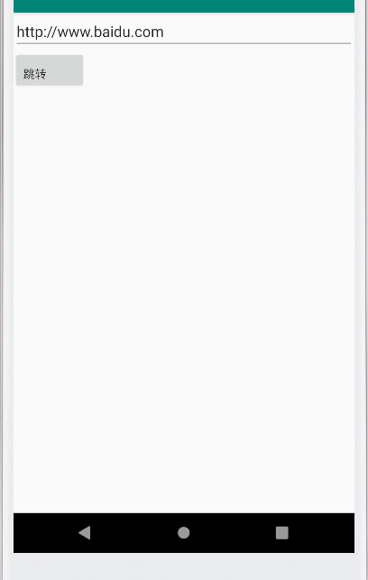
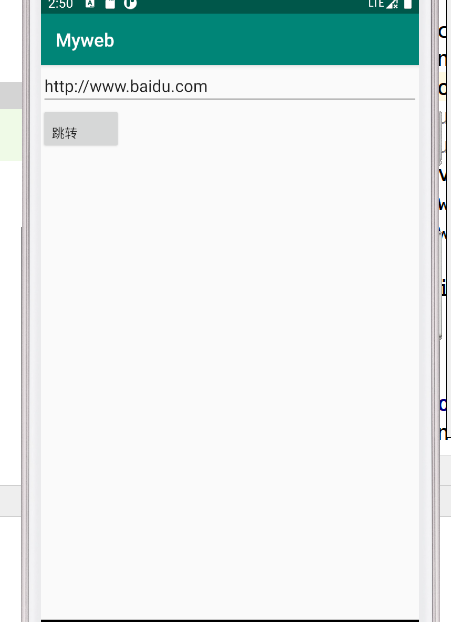
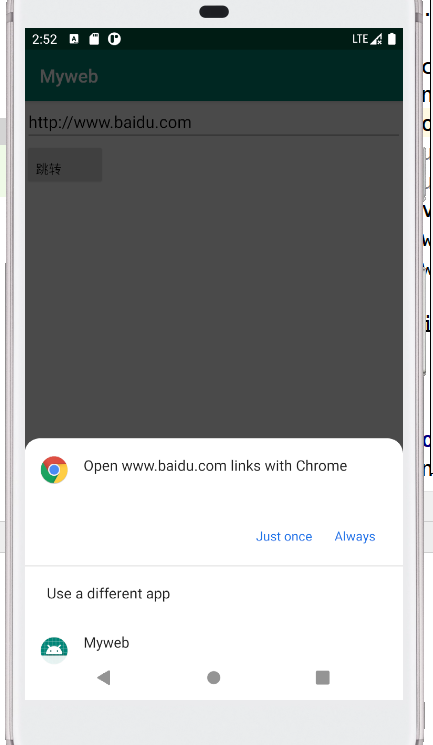

# 实验四：Internet

## 1.获取URL地址并启动隐式Intent的调用。

### (1)布局代码如下：

```xml
<?xml version="1.0" encoding="utf-8"?>
<RelativeLayout xmlns:android="http://schemas.android.com/apk/res/android"
    xmlns:tools="http://schemas.android.com/tools"
    android:layout_width="match_parent"
    android:layout_height="match_parent"
    tools:context=".MainActivity">

    <EditText
        android:id="@+id/edit1"
        android:layout_width="match_parent"
        android:layout_height="wrap_content"
        android:hint="@string/edit_name"
        android:text="http://www.baidu.com"/>

    <Button
        android:id="@+id/button_1"
        android:layout_width="wrap_content"
        android:layout_height="wrap_content"
        android:layout_below="@id/edit1"
        android:gravity="bottom"
        android:text="@string/button_name" />

</RelativeLayout>
```

### (2)java代码如下：

```java
package com.example.myapplication;
import androidx.appcompat.app.AppCompatActivity;
import android.content.Intent;
import android.net.Uri;
import android.os.Bundle;
import android.view.View;
import android.widget.Button;
import android.widget.EditText;

public class MainActivity extends AppCompatActivity {
    String Url;

    @Override
    protected void onCreate(Bundle savedInstanceState) {
        super.onCreate(savedInstanceState);
        setContentView(R.layout.activity_main);
        Button bt = findViewById(R.id.button_1);
        bt.setOnClickListener(new View.OnClickListener() {
            @Override
            public void onClick(View v) {
                EditText ed = findViewById(R.id.edit1);
                Url = ed.getText().toString().trim();
                Intent intent = new Intent(Intent.ACTION_VIEW);
                Uri uri=Uri.parse(Url);
                intent.setData(uri);
                try {
                    MainActivity.this.startActivity(intent);
                }catch (Exception e){
                    e.printStackTrace();
                }

            }
        });
    }
}
```

### (3)运行结果如下：



点击跳转按钮，结果如下：


## 2.自定义WebView来加载URL

###  (1)webview代码如下：

```xml
<?xml version="1.0" encoding="utf-8"?>
<androidx.constraintlayout.widget.ConstraintLayout
    xmlns:android="http://schemas.android.com/apk/res/android"
    xmlns:tools="http://schemas.android.com/tools"
    android:layout_width="match_parent"
    android:layout_height="match_parent"
    tools:context=".WebViewActivity">

    <WebView
        android:id="@+id/webView"
        android:layout_width="match_parent"
        android:layout_height="match_parent" />
</androidx.constraintlayout.widget.ConstraintLayout>
```

### (2)AndroidMainfest.xml代码如下：

```xml
<?xml version="1.0" encoding="utf-8"?>
<manifest xmlns:android="http://schemas.android.com/apk/res/android"
    xmlns:tools="http://schemas.android.com/tools"
    package="com.example.myapplication">

    <application
        android:allowBackup="true"
        android:icon="@mipmap/ic_launcher"
        android:label="@string/app_name"
        android:roundIcon="@mipmap/ic_launcher_round"
        android:supportsRtl="true"
        android:usesCleartextTraffic="true"
        android:theme="@style/AppTheme">
        <activity android:name=".MainActivity">
            <intent-filter>
                <action android:name="android.intent.action.MAIN" />
                <category android:name="android.intent.category.LAUNCHER" />
            </intent-filter>
        </activity>
        <activity android:name=".WebViewActivity">
            <intent-filter tools:ignore="AppLinkUrlError">
                <action android:name="android.intent.action.VIEW" />
                <category android:name="android.intent.category.DEFAULT" />
                <data android:scheme="http" />
            </intent-filter>
        </activity>
    </application>
    <uses-permission android:name="android.permission.INTERNET"></uses-permission>
</manifest>
```

## （3）java代码如下：

```java
package com.example.myapplication;

import android.app.Activity;
import android.content.Intent;
import android.net.Uri;
import android.os.Bundle;
import android.webkit.WebView;
import android.webkit.WebViewClient;
import java.net.MalformedURLException;
import java.net.URL;

public class WebViewActivity extends Activity {

    WebView webView;

    @Override
    protected void onCreate(Bundle savedInstanceState) {
        super.onCreate(savedInstanceState);
        setContentView(R.layout.webview);
        //获得浏览器webView控件
        webView = findViewById(R.id.webView);
        webView.getSettings().setJavaScriptEnabled(true);
        webView.getSettings().setAllowFileAccess(true);
        webView.getSettings().setAllowContentAccess(true);
        //得到鼠标点击之后的intent
        Intent intent = getIntent();
        Uri uri = intent.getData();
        String urlString = null;
        try {
            urlString = new URL(uri.getScheme(), uri.getHost(), uri.getPath()).toString();
        } catch (MalformedURLException e) {
            e.printStackTrace();
        }

        webView.loadUrl(urlString);//加载
        //手机默认浏览器打开，为了通过WebView打开网页，设置
        webView.setWebViewClient(new WebViewClient() {
            @Override
            public boolean shouldOverrideUrlLoading(WebView view, String url) {
                if(url.startsWith("http:") || url.startsWith("https:")){
                    view.loadUrl(url);
                    return false;
                }
                view.loadUrl(url);
                return true;
            }
        });
    }
}

```

### （4）运行结果如下：



点击跳转

