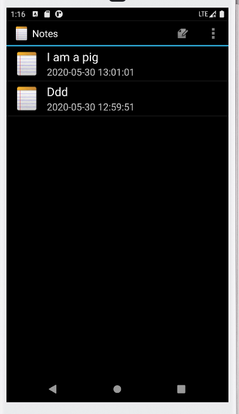
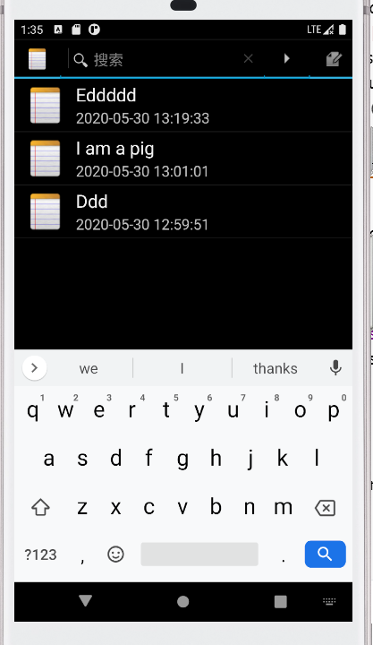
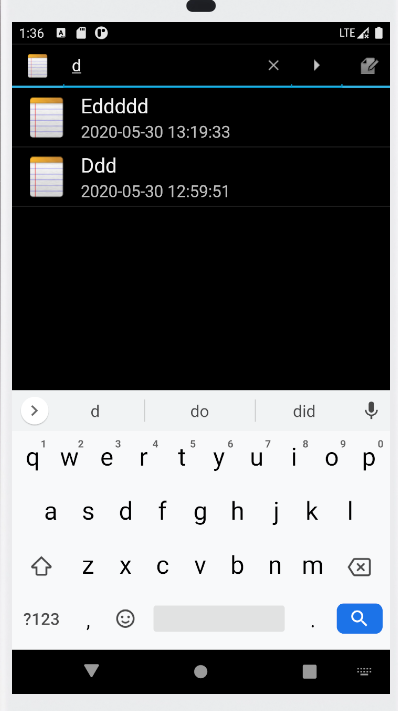

#       NotePad笔记本应用

## 1.NoteList中显示条目增加时间戳显示

### （1）修改布局文件noteslists_items.xml，增加时间戳的Textview

```xml
<?xml version="1.0" encoding="utf-8"?>
<LinearLayout xmlns:android="http://schemas.android.com/apk/res/android"
    android:layout_height="?android:attr/listPreferredItemHeight"
    android:layout_width="match_parent"
    android:orientation="horizontal">
    <ImageView
        android:layout_marginLeft="10dp"
        android:layout_width="55dp"
        android:layout_height="match_parent"
        android:src="@drawable/app_notes"

        />
    <LinearLayout android:orientation="vertical"
        android:layout_height="match_parent"
        android:layout_width="wrap_content"
        android:layout_weight="1"
        >
        <TextView xmlns:android="http://schemas.android.com/apk/res/android"
            android:id="@android:id/text1"
            android:layout_width="match_parent"
            android:layout_height="35dp"
            android:textAppearance="?android:attr/textAppearanceLarge"
            android:textSize="22dp"
            android:gravity="center_vertical"
            android:paddingLeft="10dp"
            android:paddingTop="3dp"
            android:singleLine="true"
            />
        <!-- 时间戳 -->
        <TextView xmlns:android="http://schemas.android.com/apk/res/android"
            android:id="@+id/time1"
            android:layout_width="match_parent"
            android:paddingLeft="10dp"
            android:layout_height="20dp"
            android:textSize="18dp"
            android:singleLine="true"
            />
    </LinearLayout>
</LinearLayout>
```

### (2)修改NoteEditor.java的updateNote方法，更改values的值,

```java
        Date nowTime = new Date(System.currentTimeMillis());
        SimpleDateFormat sdFormatter = new SimpleDateFormat("yyyy-MM-dd HH:mm:ss");
        String retStrFormatNowDate = sdFormatter.format(nowTime);
        ContentValues values = new ContentValues();
        values.put(NotePad.Notes.COLUMN_NAME_MODIFICATION_DATE,retStrFormatNowDate);
```

### (3)修改NoteList中PROJECTION和dataColumns，viewIDs的值，使得时间戳可以显示出来

```java
 private static final String[] PROJECTION = new String[] {
            NotePad.Notes._ID, // 0
            NotePad.Notes.COLUMN_NAME_TITLE, // 1
            NotePad.Notes.COLUMN_NAME_MODIFICATION_DATE
    };
String[] dataColumns = { NotePad.Notes.COLUMN_NAME_TITLE,NotePad.Notes.COLUMN_NAME_MODIFICATION_DATE } ;
int[] viewIDs = { android.R.id.text1,R.id.time1};
```

### (4)运行结果如下：



## 2.添加笔记查询功能(根据标题查询)

### （1）在list_options_menu.xml中添加搜索框

```xml
<?xml version="1.0" encoding="utf-8"?>
<menu xmlns:android="http://schemas.android.com/apk/res/android">
    <item android:id="@+id/search"
        android:title="search"
        android:actionViewClass="android.widget.SearchView"
        android:showAsAction="always"
        />
    <!--  This is our one standard application action (creating a new note). -->
    <item android:id="@+id/menu_add"
          android:icon="@drawable/ic_menu_compose"
          android:title="@string/menu_add"
          android:alphabeticShortcut='a'
          android:showAsAction="always" />
    <!--  If there is currently data in the clipboard, this adds a PASTE menu item to the menu
          so that the user can paste in the data.. -->
    <item android:id="@+id/menu_paste"
          android:icon="@drawable/ic_menu_compose"
          android:title="@string/menu_paste"
          android:alphabeticShortcut='p' />
</menu>
```

### （2）修改NoteList.java中的onCreateOptionsMenu方法，在方法中添加搜索框的操作

```java
   SearchView searchView = (SearchView) menu.findItem(R.id.search).getActionView();
        searchView.setSubmitButtonEnabled(true);
        searchView.setIconifiedByDefault(true);
        searchView.setIconified(true);
        searchView.setQueryHint("搜索");
        searchView.setOnQueryTextListener(new SearchView.OnQueryTextListener() {
            @Override
            public boolean onQueryTextSubmit(String s) {
                Log.i("判断之前",s);
                Cursor cursor = null;
                String[] dataColumns = {NotePad.Notes.COLUMN_NAME_TITLE,
                        NotePad.Notes.COLUMN_NAME_MODIFICATION_DATE};

                int[] viewIDs = {android.R.id.text1, R.id.time1};

                SimpleCursorAdapter adapter = null;
                if (s.length() != 0 || s != null) {
                    Log.i("判断空值", s);
                    cursor = managedQuery(
                            getIntent().getData(),           
                            PROJECTION,                      
                            NotePad.Notes.COLUMN_NAME_TITLE + " LIKE '%" + s + "%'",                            
                            null,                             
                            NotePad.Notes.DEFAULT_SORT_ORDER  
                    );
                }
                adapter = new SimpleCursorAdapter(
                        NotesList.this,                            
                        R.layout.noteslist_item,         
                        cursor,                           
                        dataColumns,
                        viewIDs
                );
                setListAdapter(adapter);
                return true;
            }

            @Override
            public boolean onQueryTextChange(String s) {
                Log.i("判断之前",s);
                Cursor cursor = null;
                String[] dataColumns = {NotePad.Notes.COLUMN_NAME_TITLE,
                        NotePad.Notes.COLUMN_NAME_MODIFICATION_DATE};

                int[] viewIDs = {android.R.id.text1, R.id.time1};

                SimpleCursorAdapter adapter = null;
                if (s.length() != 0 || s != null) {
                    Log.i("判断空值", s);
                    cursor = managedQuery(
                            getIntent().getData(),            
                            PROJECTION,                      
                            NotePad.Notes.COLUMN_NAME_TITLE + " LIKE '%" + s + "%'",                             // No where clause, return all records.
                            null,                             
                            NotePad.Notes.DEFAULT_SORT_ORDER 
                    );
                }
                adapter = new SimpleCursorAdapter(
                        NotesList.this,                            
                        R.layout.noteslist_item,         
                        cursor,                         
                        dataColumns,
                        viewIDs
                );
                setListAdapter(adapter);
                return true;
            }
        });
```

### （3）未搜索时，结果如下：



### （3）输入d时，结果如下：

